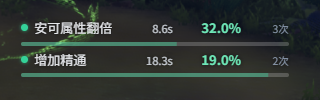
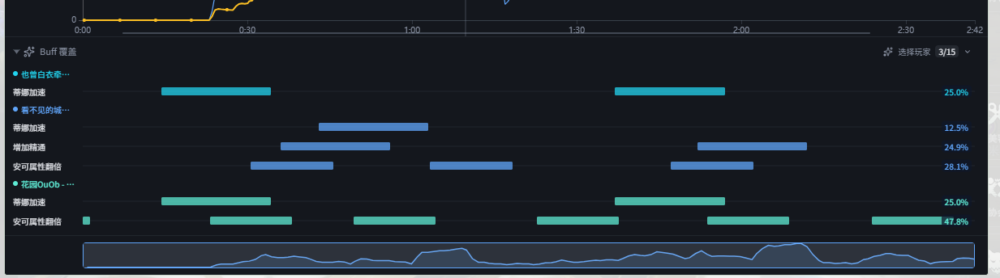
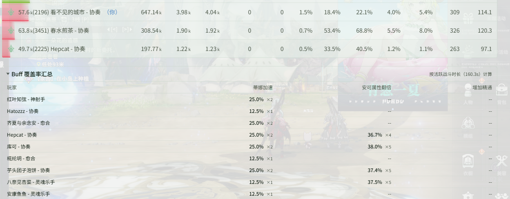
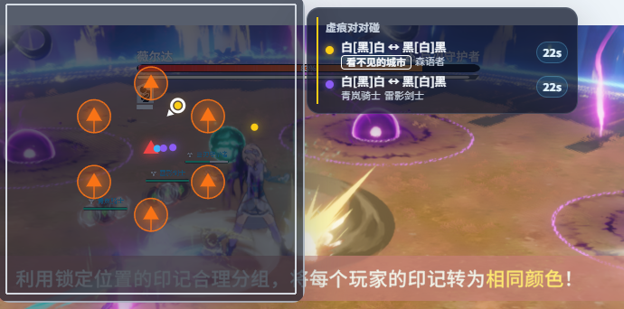
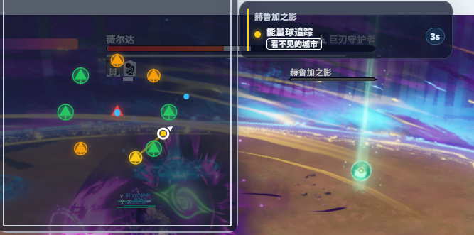

# Changelog v0.2.3

## 更新内容

### DPS / 历史

- 打桩模式新增锁定策略「首次命中怪物」(DPS检测-设置-打桩)
    - 默认为协会木桩, 首次命中后进行锁定
- DPS、历史记录时长均按最后一刀落段计算
    - 真秒伤还是活跃战斗时间计算
- DPS 表格列名支持自定义(DPS检测-设置-实时/历史-通用设置)
- 历史记录队友曲线支持再次点击切换为瞬时 DPS 曲线
- 优化历史记录曲线展示
- 新增 Buff 覆盖率：实时监控可配置监听列表，实时 overlay 展示自身覆盖率，历史记录汇总全队覆盖情况
    - 实时监控-Buff 覆盖率进行设置, 自身需要关心的 buff 覆盖率确认勾选"实时显示", 队友需要关系的 buff 覆盖率取消勾选"实时显示"(在历史记录中体现)

  

  

  

- 优化 DPS、历史界面死亡回放排版，折叠死亡 Buff 快照并后置
- 死亡回放受击可显示物/魔与元素，并支持列开关与排序（默认时间、技能、来源、伤害）(DPS检测-设置-实时/历史-死亡回放列)
- 历史死亡回放表头对齐与 DPS/治疗一致（文本列左、其余右）
- 调整历史记录样式
- 修复堡垒不会自动重置道中的问题
- 修复镜中的审判第一阶段会异常重置的问题

### 遮罩监控相关

- 增加荒芜之庭副本机制

  

  

- 统一怪物监控、实时监控样式
- 实体消失时不再清空攻击目标，避免怪物相关监控后续不再下发
- 修复 Buff 覆盖率附近角色展示不全的问题
- 修复赛季节点区和 Buff覆盖率区可能重复显示无图标 Buff 的问题
- 新增重装套装计数(实时监控-自定义监控-添加计数器)
    - 重装 S4-自动龙炮
    - 重装 S4-额外神影螺旋
- 新增冰法套装计数(实时监控-自定义监控-添加计数器)
    - 射线 S4-冰之灌注四件套

### 语音

- 新增匹配成功、队长准备确认和进本投票语音提示，并提供内置预置语音(语音播报-匹配提醒)

### 应用设置

- 新增「点击关闭按钮直接退出」选项(应用设置-通用-应用行为)
- 优化部分英文、日文翻译

### 稳定性

- 修复切换 DPS、Overlay 窗口时可能互相清空的问题，并简化窗口切换控制逻辑

## 注意事项

### 兼容性提醒

- 如果之前使用过 0.0.2 或 0.0.3，第一次使用 0.0.4-0.2.3 需要清理 `%LOCALAPPDATA%\resonance-logs-cn` 目录下的 `resonance-logs-cn.db`，再重新启动应用
- 0.2.2, 0.2.1 经历了大量重构，若原有功能出现问题请及时联系我
- 0.2.2 修改了表字段, 老的历史记录报错是正常现象, 新的正常
- 语音播报需单独下载模型；首次生成短句可能耗时较长，生成完成后播放不再加载模型

### 特别注意

- 如果你自己修改了代码又不想提交 PR，在分享给其他人的时候请把应用名、版本号等原版相关信息都改掉，不要带着原仓库的信息，尤其是应用名和版本号
- 关闭按钮现在会隐藏到右下角，可以将隐藏栏的内容拖到右下角显示，避免窗口程序过多时无法快速找到
- 常见问题见使用手册中的 HTML

### 社区

- QQ 群：`1084866292`
- Discord：https://discord.gg/RHeX47wvDU
